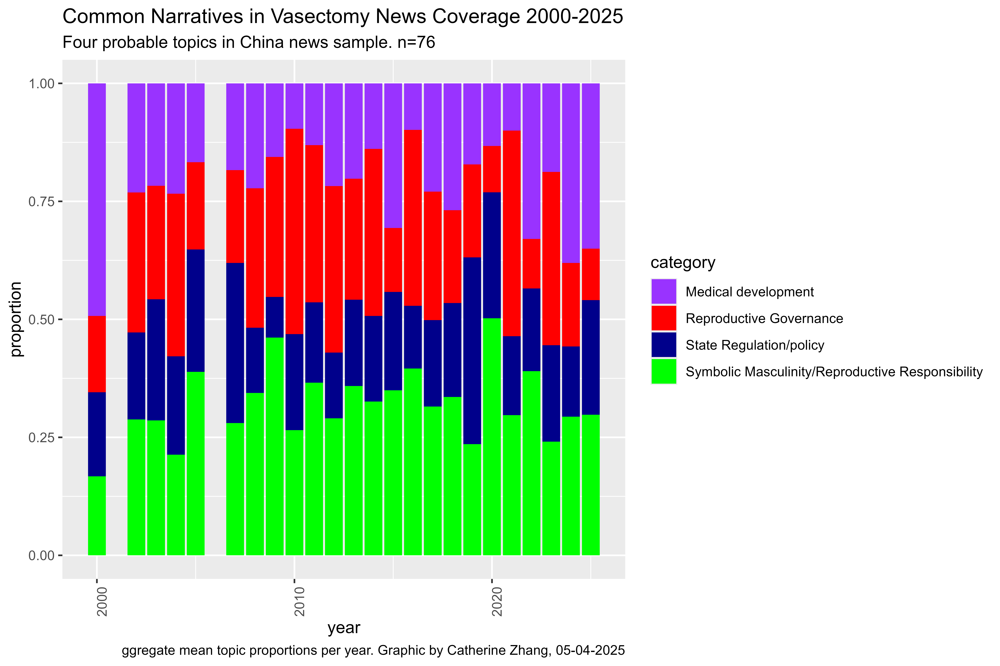

# How does the media frame vasectomy: a political issue, a gender issue, or a medical issue?

### ——A comparative content analysis on vasectomy reportings in United States and China

Catherine Yuxiao Zhang

Ph.D. student

University of Maryland Department of Communication

Email: zhangyx1\@umd.edu

------------------------------------------------------------------------

# Abstract

Vasectomy, a form of male contraception, shows distinct usage patterns
in the U.S. and China. In the U.S., over 500,000 procedures occur
annually, with a notable increase following the overturn of Roe v. Wade.
In China, once widespread under the One-Child Policy, vasectomy rates
sharply declined to fewer than 4,000 annually by 2019 after the policy
ended.

This study investigates how mainstream online news media in the U.S. and
China have set the public agenda regarding vasectomy between 2000 and
2025, analyzing gendered narratives and the politicization of
reproductive issues in digital communication environments. Drawing upon
agenda-setting theory and gender theory, the research employs a
quantitative-dominant mixed-method content analysis —including sentiment
analysis, keyword search, topic modeling and network analysis—to
systematically examine English-language coverage from major news outlets
such as The New York Times(nytimes.com), CNN(cnn.com), Fox
News(foxnews.com), NBC(NBCNEWS.com), China Daily, People's Daily, Global
Times and South China morning post.

This study addresses three core research questions: (1) What issues
(medical procedure, contraceptive decision-making, or political and
policy contexts) are emphasized by the media in each country when
covering vasectomies?  (2) How do media outlets connect vasectomy
reporting with significant political or legislative events, such as the
overturning of Roe v. Wade in the U.S. or national population policy
shifts in China? (3) What gendered narratives and emotional tones emerge
in these media reports, and how might they reflect broader cultural
differences concerning reproductive equality?

By offering cross-cultural insights, this study contributes to ongoing
scholarly discussions regarding reproductive responsibility, media
influence on public discourse, and gendered power dynamics. The findings
offer practical implications for media practitioners and policymakers
aiming to improve media literacy around reproductive issues and inform
public communication strategies to promote gender equity in reproductive
health contexts.

Keywords: Vasectomy, agenda-setting, media study, news, reproductive
health, gender

------------------------------------------------------------------------

# Literature Review

------------------------------------------------------------------------

# **Dataset Description**

**Data Source:** Nexis Uni

**Search Query:** “vasectomy or vasectomies”

**Date Range:** January 1, 2000 to December 31, 2025

**Language:** English

**Timestamp of Search:** 12 April 2025, 16:08

## **China Results Search Summary**

The search was limited to news from the region "China" (under the "News
Search by Region: China" criteria).

**Filter Settings:** All Authors, All Companies, All Subjects, All
Industries, and Source Type set to "All".

**Source Location:** China

**Results Found:** 76 articles, which will all be used to conduct
comparative analysis.

**Notes:** The query focused on the terms "vasectomy" or "vasectomies"
within the specified date range with the language restriction set to
English. Given the lower number of results, the Chinese dataset provides
a relatively smaller sample reflecting how this topic is reported in the
context of China.

## **United States Results Search Summary**

A separate search was conducted for the region "United States" (using
the "News Search by Region: United States" criteria), with a broader
specification for the source type.

**Filter Settings:** All Authors, All Companies, All Subjects, All
Industries. The Source Type includes Newspapers, Web-based Publications,
Industry Trade Press, Magazines & Journals, Aggregate News Sources, Law
Reviews & Journals, and Legal News.

**Source Location:** United States

**Results Found:** 4,279 articles

**Sampling:** From these 4,279 U.S. search results, a simple random
sampling procedure was employed to select 2,000 articles for detailed
analysis. Specifically, each of the 4,279 articles was assigned a unique
numerical identifier ranging from 1 to 4,279. Subsequently, a random
number generation method was utilized via ChatGPT to produce 2,000
distinct integers within this range. The articles corresponding to these
randomly generated numbers were then retrieved from Nexis Uni for
further examination. This approach ensured both the randomness and
representativeness (46.7% of the search results) of the sampled dataset.

**Notes:** This larger sample reflects a robust media environment
covering the topic of vasectomies in the U.S. context, offering a
diverse range of publication types.

**Overall Dataset Description:** The complete dataset comprises news
articles about vasectomies captured from Nexis Uni covering a 25-year
period. The U.S. data, with 4,279 results, is significantly larger than
the China data (76 results); however, for analytical tractability, a
random sample of 2,000 U.S. articles was selected. Both searches were
restricted to articles in English, ensuring consistency in language
across regions.

This dataset is valuable for quantitative and qualitative analysis, such
as topic modeling or trend analysis over time, and provides a
cross-regional comparison of media coverage on vasectomy-related news.

------------------------------------------------------------------------

# **Research Questions and Codebook**

This content analysis addresses three broad research questions, each of
which is further subdivided into more specific analytic questions:

| 

#### **RQ1: What issues (medical procedure, contraceptive decision-making, or political and policy contexts) are emphasized by the media in each country when covering vasectomies?** 

--Specifically, what percentage of media coverage from the U.S. and
China primarily focuses on a) medical issues, b) contraceptive
decision-making, or c) political/policy contexts?

**Theoretical framework:** Media frame and Agenda Setting

**Method:** Topic Modeling and KWIC analysis

The coding Scheme is adopted from Framing dimensions from Boydstun et
al. (2014). I picked 3 categories to mainly focus:

1.  Health and safety: health care, sanitation, public safety
2.  Cultural identity: traditions, customs, or values of a social group
    in relation to a policy issue
3.  Policy prescription and evaluation: discussion of specific policies
    aimed at addressing problems

Based on this definition of the different categories, I developed my own
codebook:

**Medical Issues (coded as 1):** Articles primarily describing vasectomy
procedures, safety, effectiveness, side effects, recovery periods,
medical advice, and healthcare information. Articles falls into this
category if the most frequent keywords are: procedure, safe, medical,
health, recovery, surgery.

**Contraceptive Decision-Making (coded as 2):** Articles highlighting
vasectomy as an individual or family planning decision, including
discussion about personal choices, family negotiation, gender
responsibility, and reproductive autonomy. Articles falls into this
category if the most frequent keywords are: decision, choice, family
planning, responsibility, gender equality, contraceptive.

**Political/Policy Context (coded as 3):** Articles primarily
emphasizing vasectomy in the context of legal decisions (e.g., Roe v.
Wade), population control policies, birth rates, government
intervention, or political controversies. Articles falls into this
category if the most frequent keywords are: roe v wade, supreme court,
birth rate, population policy, abortion, political, policy, one child
policy.

Note: I use topic modeling to identify high-frequency and contextually
relevant words in my corpus first to decide 1. How many categories are
there, and 2. Which keywords should be included in the each categories.

| 

#### **RQ2: How do media outlets connect vasectomy reporting with significant political or legislative events, such as the overturning of Roe v. Wade in the U.S. or national population policy shifts in China?**

--Specifically, how frequently is the term “Roe v. Wade” mentioned in
U.S. media coverage of vasectomy, and how frequently is the “national
population policy” (or related terms) mentioned in Chinese media
coverage of vasectomy?

**Method:** Keyword Frequency Analysis & Keyword Co-occurrence Analysis

**1. roe_mentions (Continuous)**

Definition: The number of times the phrase "roe vs. wade" or "roe" or
“Roe v. Wade", etc appears in an article.

Applicability: Only applies to U.S. articles.

Measurement: Count the occurrences using string matching with a
case-insensitive regular expression for “roe v. wade”.

**2. population_policy_mentions (Continuous)**

Definition: The number of times phrases related to the national
population policy (e.g., “population policy”) appear in an article.

Applicability: Only applies to Chinese articles.

Measurement: Count the occurrences using string matching with a
case-insensitive regular expression for “population policy” (or similar
variants as needed).

**3. A list of top 20 bigrams:** This will be used to figure out what's
the most frequently used word combanitions in both U.S. and China
vasectomy reportings.

**4. A word cloud** will also be generated to see the top mentioned
words.

| 

#### **RQ3: What gendered narratives and emotional tones emerge in these media reports, and how might they reflect broader cultural differences concerning reproductive equality?**

--Specifically, how do sentiment scores derived from the AFINN lexicon
differ between U.S. and Chinese media coverage of vasectomy, and what
proportion of articles in each country can be classified as positive,
neutral, or negative based on these scores?

**Method:** Sentiment Analysis

**1. Sentiment Category (Categorical)**

Definition: A classification of an article’s overall sentiment based on
its computed AFINN Sentiment Score.

Categories & Criteria: Positive: sentiment_score \> 0；Neutral:
sentiment_score = 0；Negative: sentiment_score \< 0

To complement topic modeling and deepen the interpretation of media
narratives, sentiment analysis was employed to assess the emotional tone
of vasectomy-related news coverage. By categorizing texts as positive,
neutral, or negative in sentiment, this approach provides insight into
how media outlets construct affective frames around key themes such as
reproductive policy, medical decision-making, or gender responsibility.
Sentiment analysis enhances the understanding of not only what topics
are being discussed, but also how they are emotionally portrayed—whether
vasectomy is framed as empowering, controversial, or stigmatized. This
layer of analysis enables a comparative evaluation of the attitudinal
stance embedded in U.S. and Chinese media discourse, revealing potential
ideological or cultural divergences in reproductive health
communication.

**In addition,** besides topic modeling, **keyword co-occurrence network
analysis** was conducted to further explore relationships among terms
within media coverage. This analysis visually illustrates how frequently
specific keywords appear together, thereby revealing the structural
associations and underlying discursive patterns within news narratives
(Bail, 2016). By mapping keyword connections—such as the frequent
co-occurrence of "policy" with "restriction" or "procedure" with
"safety"—the analysis provides insights into how media outlets
implicitly frame vasectomy-related discussions. Such visualization not
only complements the findings from topic modeling by verifying topic
coherence but also highlights subtle but meaningful differences in how
distinct concepts are linked in U.S. and Chinese media contexts.

------------------------------------------------------------------------

# Results

## **Load useful packages and datasets**

```{r echo=TRUE, results='hide', message=FALSE, warning=FALSE}
library(tidyverse)
library(janitor)
library(striprtf)
library(dplyr)
library(readxl)
library(lubridate)
library(writexl)
library(tidytext)
library(stringr) 
library(rio)
library(quanteda)
library(readtext)

```

```{r echo=TRUE, message=FALSE, warning=FALSE}
#impotying U.S. data
vasus <- read_excel("Results list us.xlsx", 
    col_types = c("text", "date", "text", 
        "text", "text", "numeric", "text", 
        "numeric", "numeric", "text", "numeric", 
        "text", "text", "text", "text", "text", 
        "text", "numeric", "numeric", "numeric", 
        "numeric"))

vasus <- janitor::clean_names(vasus)

nrow(vasus)
ncol(vasus)
print(paste0("The number of rows in the dataset is ", nrow(vasus), " and the number of columns in the dataset is ", ncol(vasus)))

```

```{r echo=TRUE, message=FALSE, warning=FALSE}
#impotying China data
vascn <- read_excel("Results list cn.xlsx", 
    col_types = c("text", "date", "text", 
        "text", "text", "numeric", "text", 
        "numeric", "numeric", "text", "numeric", 
        "text", "text", "text", "text", "text", 
        "text", "numeric", "numeric", "numeric", 
        "numeric"))

vascn <- janitor::clean_names(vascn)

nrow(vascn)
ncol(vascn)
print(paste0("The number of rows in the dataset is ", nrow(vascn), " and the number of columns in the dataset is ", ncol(vascn)))

```

## **Overall Statistical Description of the Datasets**

The overall statistical description of the dataset comes from Nexis Uni.
I use R to regenerate some important visuals to better reflect the basic
trands in each U.S. and Chinese dataset. The overall statistical
descriptions I chose from Nexis Uni are: coverage over time, top
publications covering these stories, top subjects mentioned in these
stories.

### **1. The coverage of vasectomy over time**

#### U.S. Dataset

According to Nexis Uni, for the 4279 U.S. articles, the coverage of
vasectomy over time can see as below:

```{r echo=TRUE, message=FALSE, warning=FALSE}
library(readr)
Coverus <- read_csv("us_charts/CoverageoverTime_vasectomyvasectomies.csv")
Coverus <- janitor::clean_names(Coverus)
Coverus <- Coverus %>%
  mutate(covertime = as.Date(coverage_over_time))

p <- ggplot(Coverus, aes(x = covertime, y = coverage)) +
  geom_line(color = "blue", size = 1) +
  geom_point(color = "red", size = 2) +
  labs(title = "Coverage of Vasectomy/Vasectomies Over Time, U.S.",
       x = "Year",
       y = "Number of Articles",
        caption = "Data source: Nexis Uni, accessed on May 3, 2025"
  ) +
  theme_minimal() +
  theme(
    plot.caption = element_text(hjust = 0, size = 9, face = "italic") ) 
p

```

This figure illustrates the temporal distribution of media coverage on
vasectomy between 2000 and 2025. Coverage remained relatively low and
stable from 2000 to 2010, followed by a moderate increase between 2011
and 2015. A notable surge occurred in 2022, aligning with the
overturning of *Roe v. Wade*, indicating heightened media attention in
response to political and legislative changes. The peak in 2022 was
followed by a sharp fluctuation, suggesting a reactive media pattern
tied to external socio-political events.

Here, I use the subtracted 2000 article dataset to visualize the
coverage change over time again:

```{r warning=FALSE}
vas_time <- vasus %>%
  mutate(year = year(published_date)) %>%  
  group_by(year) %>%
  summarise(count = n()) %>%
  ungroup()

p2 <- ggplot(vas_time, aes(x = year, y = count)) +
  geom_bar(stat = "identity", fill = "steelblue") +
  labs(title = "Distribution of Articles Over Time",
       x = "Year",
       y = "Number of Articles",
       caption = "Data source: Nexis Uni, accessed on May 3, 2025") +
  theme_minimal()
print(p2)

```

The two charts shows similar pattern: Coverage remained relatively low
and stable from 2000 to 2010, followed by a moderate increase between
2011 and 2015. A notable surge occurred in 2022, aligning with the
overturning of *Roe v. Wade*. This further proves that the subtracted
dataset fully represent the full 4279 dataset.

#### China Dataset

According to Nexis Uni, for the 76 China articles, the coverage of
vasectomy over time can see as below:

```{r echo=TRUE, message=FALSE, warning=FALSE}
Covercn <- read_csv("cn_charts/CoverageoverTime_vasectomyvasectomies.csv")
Covercn <- janitor::clean_names(Covercn)
Covercn <- Covercn %>%
  mutate(covertime = as.Date(coverage_over_time))

c <- ggplot(Covercn, aes(x = covertime, y = coverage)) +
  geom_line(color = "blue", size = 1) +
  geom_point(color = "red", size = 2) +
  labs(title = "Coverage of Vasectomy/Vasectomies Over Time, China",
       x = "Year",
       y = "Number of Articles",
      caption = "Data source: Nexis Uni, accessed on May 3, 2025") +
  theme_minimal()

c

```

China’s birth control policy has undergone three major shifts over the
past decade. The first, the “Selective Two-Child Policy” introduced in
2013, allowed couples to have two children if one parent was an only
child and marked the beginning of the end of the One-Child Policy, which
had been in place for 35 years. This was followed by the “Universal
Two-Child Policy” implemented in 2016, which extended the right to have
two children to all couples. In 2021, the “Three-Child Policy” was
launched in an effort to mitigate the challenges of an aging population
and declining fertility rates.

While the dataset used in this study captures only English-language
reporting by Chinese media—limiting its ability to reflect the full
spectrum of domestic discourse—it nonetheless reveals meaningful trends.
From 2000 to 2025, media coverage of vasectomy in China remains sparse
and inconsistent. As shown in gigure, the annual number of articles
rarely exceeds single digits, with only a few notable peaks, such as in
2010 and 2014, which loosely align with the initial stages of policy
loosening. Interestingly, coverage appears to increase slightly during
periods when the government began promoting higher birth rates,
suggesting a potential disconnect between state pronatalist goals and
public attitudes.

The consistently minimal coverage further suggests that vasectomy has
not been positioned as a significant topic in Chinese public discourse
on fertility. This contrasts sharply with patterns observed in U.S.
media, where reporting on vasectomy surged following the 2022
overturning of Roe v. Wade, reflecting a more responsive media
environment shaped by reproductive rights debates. The persistent
marginalization of vasectomy in Chinese media likely reflects both its
politically sensitive nature and a broader cultural context in which
pronatalist messaging and traditional gender norms continue to assign
contraceptive responsibility primarily to women.

### **2. The top publications of vasectomy related coverage**

#### U.S. Dataset

```{r echo=TRUE, message=FALSE, warning=FALSE}
top_pub <- read_csv("us_charts/TopPublications_vasectomyvasectomies.csv")

ggplot(top_pub, aes(x = reorder(Publication, Coverage), y = Coverage)) +
  geom_col(fill = "steelblue") +
  labs(title = "Top Publications for Vasectomy/Vasectomies, U.S.",
       x = "Publication",
       y = "Count",
        caption = "Data source: Nexis Uni, accessed on May 3, 2025") +
  coord_flip() +
  theme_minimal()
  
```

#### China Dataset

```{r echo=TRUE, message=FALSE, warning=FALSE}
top_pubcn <- read_csv("cn_charts/TopPublications_vasectomyvasectomies.csv")

ggplot(top_pubcn, aes(x = reorder(Publication, Coverage), y = Coverage)) +
  geom_col(fill = "steelblue") +
  labs(title = "Top Publications for Vasectomy/Vasectomies, China",
       x = "Publication",
       y = "Count",
        caption = "Data source: Nexis Uni, accessed on May 3, 2025") +
  coord_flip() +
  theme_minimal()
  
```

A comparison of top publication sources for vasectomy-related coverage
reveals stark differences between Chinese and U.S. media environments.
In China, English reporting is highly concentrated among a few official
outlets, such as Xinhua News Service and China Daily, with overall
coverage volumes remaining low. In contrast, U.S. media coverage is both
more frequent and more diverse, encompassing national newspapers, local
press, and specialized health industry publications. These patterns
reflect broader structural differences in media systems: China’s
state-led communication model limits the diversity and volume of
discourse, while the U.S. media landscape facilitates more expansive and
decentralized engagement with reproductive health topics.

### **3. The top subjects covered by vasectomy related reporting**

#### U.S. Dataset

```{r echo=TRUE, message=FALSE, warning=FALSE}
library(treemapify)

subus <- read_csv("us_charts/TopSubjectsCovered_vasectomyvasectomies.csv")
ggplot(subus, aes(
  area = Coverage,             
  fill = `Top Subjects Covered`,           
  label = `Top Subjects Covered`          
)) +
  geom_treemap() +
  geom_treemap_text(
    colour = "white", 
    place = "centre", 
    grow = TRUE, 
    reflow = TRUE
  ) +
  labs(title = "Top Subjects Covered, U.S.",
       caption = "Data source: Nexis Uni, accessed on May 3, 2025") +
  theme_minimal()

```

#### China Dataset

```{r echo=TRUE, message=FALSE, warning=FALSE}
subcn <- read_csv("cn_charts/TopSubjectsCovered_vasectomyvasectomies.csv")
ggplot(subcn, aes(
  area = Coverage,             
  fill = `Top Subjects Covered`,           
  label = `Top Subjects Covered`          
)) +
  geom_treemap() +
  geom_treemap_text(
    colour = "white", 
    place = "centre", 
    grow = TRUE, 
    reflow = TRUE
  ) +
  labs(title = "Top Subjects Covered, China",
       caption = "Data source: Nexis Uni, accessed on May 3, 2025") +
  theme_minimal()

```

The treemap comparison highlights clear differences in basic thematic
framing between Chinese and U.S. media coverage of vasectomy. In both
countries, "Medicine & Health" emerges as the dominant subject,
reflecting the procedure's clinical identity. However, U.S. coverage
incorporates a broader range of categories, including "Government &
Public Administration" and "Humanities & Social Science," suggesting a
more complex framing that links vasectomy to political discourse,
reproductive rights, and gender roles. In contrast, Chinese media
primarily associate the topic with health and lifestyle, with limited
representation of policy or social critique. The presence of "Negative
News" in Chinese coverage may indicate risk-focused narratives that we
can further take a look.

------------------------------------------------------------------------

## **Topic modeling**

**RQ1: What issues (medical procedure, contraceptive decision-making, or
political and policy contexts) are emphasized by the media in each
country when covering vasectomies?** 

--Specifically, what percentage of media coverage from the U.S. and
China primarily focuses on a) medical issues, b) contraceptive
decision-making, or c) political/policy contexts?

### 1. Text compiler

#### U.S. Dataset

```{r eval=FALSE}

# Set the paths
input_folder <- "./us_files_random_2000" 
output_folder <- "./us_files_raw_text"

# Create output folder if it doesn't exist
if (!dir.exists(output_folder)) {
  dir.create(output_folder)
}

# Get a list of all .rtf files in the input folder
rtf_files <- list.files(path = input_folder, pattern = "\\.RTF$", full.names = TRUE)

# Convert each .rtf file to .txt
for (file in rtf_files) {
  # Extract the file name without extension
  file_name <- tools::file_path_sans_ext(basename(file))
  
  # Read the RTF content
  rtf_content <- read_rtf(file)
  
  # Create output file path
  output_file <- file.path(output_folder, paste0(file_name, ".txt"))
  
  # Write the content to a .txt file
  writeLines(rtf_content, output_file)
  
  # Print progress
  cat("Converted:", file, "to", output_file, "\n")
}

cat("Conversion complete!\n")
```

**Raw text compiler**

```{r eval=FALSE}
#This creates an index with the file path to the stories. And then it compiles the stories into a dataframe
#####################
# Begin SM Code #####
#####################

###
# List out text files that match pattern .txt, create DF
###

#Adjust thisline for your file name
files <- list.files("./us_files_raw_text", pattern="*.txt") %>% 
  as.data.frame() |> 
  rename(filename = 1) |> 
  #create an matching file name
  mutate(index = str_replace_all(filename, ".txt", "")) %>%
  mutate(index = tolower(gsub("[[:punct:][:space:]|]", "", index))) |> 
  mutate(index = tolower(index)) |> 
  mutate(index = str_sub(index, 1, 25)) |> 
  distinct(index, .keep_all = TRUE)


#Join the file list to the index

final_data <- rio::import("Results list us.XLSX") |> 
  clean_names() |> 
   #create an matching file name
  mutate(index = tolower(gsub("[[:punct:][:space:]|]", "", title))) |> 
  mutate(index = tolower(index)) |> 
  mutate(index = str_sub(index, 1, 25)) |> 
  distinct(index, .keep_all = TRUE)
```

**Check for duplicate entries**

```{r eval=FALSE}
final_data |> 
  count(title) |> 
  arrange(desc(n))
```

```{r eval=FALSE}
dupe_data <- rio::import("Results list us.XLSX") |> 
  clean_names() |> 
   #create an matching file name
  mutate(index = tolower(gsub("[[:punct:][:space:]|]", "", title))) |> 
  mutate(index = tolower(index)) |> 
  mutate(index = str_sub(index, 1, 25))
```

```{r eval=FALSE}
dupe_data |> 
  count(title) |> 
  arrange(desc(n))
```

```{r eval=FALSE}

final_index <- final_data |> 
  inner_join(files, c("index")) |> 
#you need the actual hard-coded path on this line below to the text
  mutate(filepath = paste0("./us_files_raw_text/", filename))

head(final_index)

```

**Fact Check**

```{r eval=FALSE}
anti_final_index <- final_data |> 
  anti_join(files, c("index"))
```

**Checking for duplicates**

```{r eval=FALSE}
final_index |> 
  count(title) |> 
  arrange(desc(n))

```

**Text compiler**

```{r eval=FALSE}
create_article_text <- function(row_value) {
  
  #row_value is the single argument that is passed to the function
  # Take each row of the dataframe
  temp <- final_index %>%
    slice(row_value)
  
  # Store the filename for  use in constructing articles dataframe
  temp_filename <- temp$filename
  
  # Create a dataframe by reading in lines of a given textfile
  # Add a filename column 
  articles_df_temp <- read_lines(temp$filepath) %>%
    as_tibble() %>%
    mutate(filename = temp_filename)
  
  # Bind results to master articles_df
  # <<- returns to global environment
  articles_df <<- articles_df %>%
    bind_rows(articles_df_temp)
}

###
# Create elements needed to run function
###

# Create empty tibble to store results
articles_df <- tibble()
#running once to test
#create_article_text(2) 
# Create an array of numbers to loop through, from 1 to the number of rows in our index dataframe 
row_values <- 1:nrow(final_index)

###
# Execute function using lapply
# This loops through each row of the dataframe and append results to master file
###

lapply(row_values, create_article_text)

###
# Clean up articles_df and join to index dataframe
###

articles_df <- articles_df %>%
  select(filename, sentence=value) %>%
  inner_join(final_index)

#write.csv(articles_df, "./us_article_df.csv")

```

**I did same text compiling for the Chinese dataset.**

------------------------------------------------------------------------

### 2. Topic Modeling

#### U.S. Data

```{r echo=TRUE, results='hide', message=FALSE, warning=FALSE}
# set options
options(stringsAsFactors = F)         # no automatic data transformation
options("scipen" = 100, "digits" = 4) # suppress math annotation
# load packages
here::here()
library(tidyverse)
library(tidytext)
library(rio)
library(readtext)
#topic modeling
library(quanteda)
library(tm)
library(topicmodels)
library(lda)
library(ldatuning)
# from tutorial packages
library(DT)
library(knitr) 
library(kableExtra) 
library(reshape2)
library(ggplot2)
library(wordcloud)
library(pals)
library(SnowballC)
library(flextable)
```

### Import Data

```{r echo=TRUE, message=FALSE, warning=FALSE}
#import text files that were compiled into a df  
vasus_sent <- read_csv("./us_article_df.csv")

#add a year column
vasus_sent <- vasus_sent %>%
  mutate(year = year(published_date))

vascn_sent <- read_csv("./cn_article_df.csv")

#add a year column
vascn_sent <- vascn_sent %>%
  mutate(year = year(published_date))

```

```{r}
textdata <- vasus_sent %>% 
  select(filename, sentence, year) %>% 
  as.data.frame() %>% 
  rename(doc_id = filename, text= sentence)

# load stopwords
english_stopwords <- readLines("https://slcladal.github.io/resources/stopwords_en.txt", encoding = "UTF-8")

custom_stop_words <- bind_rows(
  tibble(word = c("U.S.", "date", "english", "language", "usa", "copyright", 
                  "publication", "reserved", "news", "newspaper","photograph","photo"),
         lexicon = rep("custom", 12)), 
  stop_words
)

```

```{r}
# create corpus object
corpus_us <- Corpus(DataframeSource(textdata))
# Preprocessing chain
processedCorpus <- tm_map(corpus_us, content_transformer(tolower))
processedCorpus <- tm_map(processedCorpus, removeWords, english_stopwords)
processedCorpus <- tm_map(processedCorpus, removeWords, custom_stop_words$word)
processedCorpus <- tm_map(processedCorpus, removePunctuation, preserve_intra_word_dashes = TRUE)
processedCorpus <- tm_map(processedCorpus, removeNumbers)
processedCorpus <- tm_map(processedCorpus, stemDocument, language = "en")
processedCorpus <- tm_map(processedCorpus, stripWhitespace)
```

```{r tm3a}
#DTM: rows correspond to the documents in the corpus. Columns correspond to the terms in the documents. Cells correspond to the weights of the terms. (Girder)
# compute document term matrix with terms >= minimumFrequency
minimumFrequency <- 5
DTM <- DocumentTermMatrix(processedCorpus, control = list(bounds = list(global = c(minimumFrequency, Inf))))
# have a look at the number of documents and terms in the matrix
dim(DTM)
# due to vocabulary pruning, we have empty rows in our DTM
# LDA does not like this. So we remove those docs from the
# DTM and the metadata
sel_idx <- slam::row_sums(DTM) > 0
DTM <- DTM[sel_idx, ]
textdata <- textdata[sel_idx, ]

```

**Topic proportions over time**

We examine topics in the data over time by aggregating mean topic
proportions per year. These aggregated topic proportions can then be
visualized, e.g. as a bar plot.

```{r tm12, results='hide', message=FALSE, warning=FALSE}
# number of topics
# K <- 20
K <- 6
# set random number generator seed
set.seed(9161)
#Latent Dirichlet Allocation, LDA
topicModel2 <- LDA(DTM, K, method="Gibbs", control=list(iter = 500, verbose = 25, alpha = 0.2))
tmResult <- posterior(topicModel2)
theta <- tmResult$topics
beta <- tmResult$terms
topicNames <- apply(terms(topicModel2, 10), 2, paste, collapse = " ")  # reset topicnames
```

**Mean topic proportions per year**

```{r message=FALSE, warning=FALSE}
# Step 1: Check dimensions
n_theta <- nrow(theta)
n_textdata <- length(textdata$year)

cat("Number of rows in theta: ", n_theta, "\n")
cat("Number of documents in textdata: ", n_textdata, "\n")

# Check if textdata contains all the documents in theta
common_ids <- intersect(rownames(theta), textdata$doc_id) # Assuming textdata has a 'doc_id' column

# Filter textdata to include only the documents present in theta
textdata_filtered <- textdata[textdata$doc_id %in% common_ids, ]

# Check dimensions after filtering
n_textdata_filtered <- nrow(textdata_filtered)
cat("Number of documents in filtered textdata: ", n_textdata_filtered, "\n")

# Ensure the lengths match now
if (n_theta != n_textdata_filtered) {
  stop("The number of rows in 'theta' still does not match the length of 'textdata_filtered$year'.")
}

# Align rownames of theta with filtered textdata
theta_aligned <- theta[rownames(theta) %in% textdata_filtered$doc_id, ]

# Optional: Verify the order of documents
if (!all(rownames(theta_aligned) == textdata_filtered$doc_id)) {
  # If the order doesn't match, reorder one to match the other
  textdata_filtered <- textdata_filtered[match(rownames(theta_aligned), textdata_filtered$doc_id), ]
}

# Ensure they are now aligned and can be combined
if (!all(rownames(theta_aligned) == textdata_filtered$doc_id)) {
  stop("The document IDs still do not match. Please check the data alignment.")
}

# Step 2: Combine data
topic_data <- data.frame(theta_aligned, year = textdata_filtered$year)

# Step 3: Aggregate data
topic_proportion_per_year <- aggregate(. ~ year, data = topic_data, FUN = mean)


# get mean topic proportions per decade
# topic_proportion_per_decade <- aggregate(theta, by = list(decade = textdata$decade), mean)
# set topic names to aggregated columns
colnames(topic_proportion_per_year)[2:(K+1)] <- topicNames
# reshape data frame
vizDataFrame <- melt(topic_proportion_per_year, id.vars = "year")

```

```{r}
#enframe(): Converts a named list into a dataframe.
topics <- enframe(topicNames, name = "number", value = "text") %>% 
  unnest(cols = c(text)) 
  
topics
```

**Review the topics and determine a 1-2 word label after reading the
source documents.**

*Topic 1 - abort health women peopl plan care law govern servic countri*

```{r}
theta2 <- as.data.frame(theta)

topic1 <- theta2 %>% 
  rownames_to_column(var = "file") |>
  mutate(file = str_remove(file, "^X"),  
         line = str_extract(file, "(?<=\\.txt)\\.\\d+")) |>  
  mutate(file = str_remove(file, "\\.\\d+$")) |> 
  rename(topic1 = '1') |> 
  top_n(20, topic1) |> 
  arrange(desc(topic1)) |>  
  select(file, line, topic1) 

```

These articles share a focus on how vasectomy is framed within broader
debates about gender roles, reproductive rights, and state control. They
highlight how male sterilization is politicized—used symbolically in
legislation, population policies, or as a measure of gendered
responsibility in contraception.

*Topic 2 - women patient contracept vasectomi birth control pregnanc
studi health procedur*

```{r}
topic2 <- theta2 %>% 
  rownames_to_column(var = "file") |> # putting the rownames into a new column called file
  mutate(file = str_remove(file, "^X"),  # Remove leading 'X'
         line = str_extract(file, "(?<=\\.txt)\\.\\d+")) |>   # Extract number after .txt
  mutate(file = str_remove(file, "\\.\\d+$")) |> 
  rename(topic2 = '2') |> 
  top_n(20, topic2) |> 
  arrange(desc(topic2)) |>  
  select(file, line, topic2) 
```

Most articles focus on issues of reproductive autonomy and gender
equity. They highlight how structural or psychological factors—such as
coercion, trauma, or population control policies—impact individuals'
access to and control over contraceptive decisions.

*Topic 3 - time day children peopl famili life love feel live told*

```{r}
topic3 <- theta2 %>% 
  rownames_to_column(var = "file") |> 
  mutate(file = str_remove(file, "^X"),  
         line = str_extract(file, "(?<=\\.txt)\\.\\d+")) |>   
  mutate(file = str_remove(file, "\\.\\d+$")) |> 
  rename(topic3 = '3') |> 
  top_n(20, topic3) |> 
  arrange(desc(topic3)) |>  
  select(file, line, topic3) 

```

Across these articles, vasectomy is rarely discussed in medical or
policy terms; instead, it appears almost exclusively as a rhetorical
device to express a point or create narrative tension. Often used
humorously, it serves as a symbolic marker of male reproductive control.
This may reflect that in cultural storytelling, male contraception
remains more of a punchline than a subject of serious reflection.

*Topic 4 - univers time york compani john citi michael edit david march*

```{r}

topic4 <- theta2 %>% 
  rownames_to_column(var = "file") |> 
  mutate(file = str_remove(file, "^X"),  
         line = str_extract(file, "(?<=\\.txt)\\.\\d+")) |>   
  mutate(file = str_remove(file, "\\.\\d+$")) |> 
  rename(topic4 = '4') |> 
  top_n(20, topic4) |> 
  arrange(desc(topic4)) |>  
  select(file, line, topic4) 
```

Similar to topic 3, these articles focus on cultural narrative, where
vasectomy is rarely framed as a responsible reproductive choice;
instead, it frequently appears as a source of humor, surprise, or
dramatic irony. This may reflect the broader tendency to marginalize
male contraception and treat it as a symbolic or comedic device rather
than a serious subject.

*Topic 5 - word length right newstex content inform court employe provid
law*

```{r}
topic5 <- theta2 %>% 
  rownames_to_column(var = "file") |> 
  mutate(file = str_remove(file, "^X"), 
         line = str_extract(file, "(?<=\\.txt)\\.\\d+")) |>  
  mutate(file = str_remove(file, "\\.\\d+$")) |> 
  rename(topic5 = '5') |> 
  top_n(20, topic5) |> 
  arrange(desc(topic5)) |>  
  select(file, line, topic5) 

```

These articles revolve around how legal frameworks—whether criminal law
or reproductive rights—shape, restrict, or provoke personal bodily
decisions, highlighting tensions between institutional authority and
individual autonomy.

*Topic 6 - special ave bodi surgeri document fairfax rockvill diseas
arlington bethesda*

```{r}
topic6 <- theta2 %>% 
  rownames_to_column(var = "file") |> 
  mutate(file = str_remove(file, "^X"),  
         line = str_extract(file, "(?<=\\.txt)\\.\\d+")) |> 
  mutate(file = str_remove(file, "\\.\\d+$")) |> 
  rename(topic6 = '6') |> 
  top_n(20, topic6) |> 
  arrange(desc(topic6)) |>  
  select(file, line, topic6) 

```

These articles present vasectomy as a medical procedure within the
context of clinical care and professional specialization. They frame
vasectomy primarily as a routine, medically managed procedure rather
than a cultural or political statement.

*Add Categories to each topic*

```{r}
vizDataFrame <- vizDataFrame %>%
  mutate(variable = str_to_lower(variable),variable = str_squish(variable)) %>%
  mutate(category = case_when(
    variable == "abort health women peopl plan care law govern servic countri" ~ "politics",
    variable == "women patient contracept vasectomi birth control pregnanc studi health procedur" ~ "gender equality",
    variable == "time day children peopl famili life love feel live told" ~ "symbolic meaning/satire",
    variable == "univers time york compani john citi michael edit david march" ~ "rhetoric and humours meaning",
    variable == "word length right newstex content inform court employe provid law" ~ "law and rights",
    variable == "special ave bodi surgeri document fairfax rockvill diseas arlington bethesda" ~ "medical",
    TRUE ~ "other"
  ))

```

**Sample Fact Check and Validate Topics**

+--------------------+--------------------+--------------------+
| Nu mber            | Keywords           | Catergory          |
+====================+====================+====================+
| T opic 1           | abort health women | Politics           |
|                    | peopl plan care    |                    |
|                    | law govern servic  |                    |
|                    | countri            |                    |
+--------------------+--------------------+--------------------+
| T opic 2           | women patient      | Gender Equality    |
|                    | contracept         |                    |
|                    | vasectomi birth    |                    |
|                    | control pregnanc   |                    |
|                    | studi health       |                    |
|                    | procedur           |                    |
+--------------------+--------------------+--------------------+
| T opic 3           | time day children  | Symbolic Mea ni    |
|                    | peopl famili life  | ng/Satire          |
|                    | love feel live     |                    |
|                    | told               |                    |
+--------------------+--------------------+--------------------+
| T opic 4           | univers time york  | Rhetoric & Humours |
|                    | compani john citi  | Meaning            |
|                    | michael edit david |                    |
|                    | march              |                    |
+--------------------+--------------------+--------------------+
| T opic 5           | word length right  | Law and Rights     |
|                    | newstex content    |                    |
|                    | inform court       |                    |
|                    | employe provid law |                    |
+--------------------+--------------------+--------------------+
| T opic 6           | special ave bodi   | Medical            |
|                    | surgeri document   |                    |
|                    | fairfax rockvill   |                    |
|                    | diseas arlington   |                    |
|                    | bethesda           |                    |
+--------------------+--------------------+--------------------+

**For politics**

```{r message=FALSE, warning=FALSE}
politics <- theta2 %>% 
  #renaming for a general topic
  rename(politics = '1') %>% 
  top_n(20, politics) %>%
  arrange(desc(politics )) %>% 
  select(politics )

# Apply rownames_to_column
politics <- tibble::rownames_to_column(politics , "story_id") 

politics$story_id <- gsub("X", "", politics$story_id)

head(politics$story_id, 20)

```

**Visualizting Topic modeling of U.S. sample**

```{r message=FALSE, warning=FALSE}
ggplot(vizDataFrame, aes(x=year, y=value, fill=category)) + 
  geom_bar(stat = "identity") + ylab("proportion") + 
  scale_fill_manual(values = paste0(alphabet(20), "FF"), name = "year") + 
  theme(axis.text.x = element_text(angle = 90, hjust = 1)) +
   scale_fill_manual(values=c("red",
                              "yellow",
                              "darkblue",
                              "blue",
                              "pink",
                              "orange")) +
  labs(title = "Common Narratives in Vasectomy News Coverage 2000-2025",
       subtitle = "Six probable topics in U.S. news sample. n=2000",
       caption = "Aggregate mean topic proportions per year. Graphic by Catherine Zhang, 05-04-2025")

#ggsave(here::here("./Figure_US_topics_04_04_2025.png"),device = "png",width=9,height=6, dpi=800)
```

#### A similar topic modeling was done for the china coverage

Here's the visualization of China topics

+:---------------+:---------------------+----------------------+
| Topic 1        | health reproduct     | State Regu l         |
|                | public depart        | ation/policy         |
|                | surgeri govern       |                      |
|                | famili transplant    |                      |
|                | sexual medic         |                      |
+----------------+----------------------+----------------------+
| Topic 2        | contracept vasectomi | Medical development  |
|                | women male effect    |                      |
|                | control sperm hospit |                      |
|                | condom research      |                      |
+----------------+----------------------+----------------------+
| Topic 3        | famili plan children | Reproductive         |
|                | popul birth child    | Governance           |
|                | govern coupl zhang   |                      |
|                | vasectomi            |                      |
+----------------+----------------------+----------------------+
| Topic 4        | morn classif reserv  | Symbolic             |
|                | bodi publish inform  | Masculinity/         |
|                | daili time media     |                      |
|                | monday               | Reproductive R e     |
|                |                      | sponsibility         |
+----------------+----------------------+----------------------+



### **United States: Common Narratives in Vasectomy News Coverage (2000–2025)**

The U.S. figure presents topic proportions from 2,000 U.S. news
articles, showing a diverse thematic distribution across six main
topics. **“Rhetoric and Humorous Meaning”** (pink) and **“Symbolic
Meaning/Satire”** (orange) have remained consistently dominant,
reflecting the long-standing tendency in American media to frame
vasectomy with irony, humor, or as a narrative twist, but not a serious
reproductive choice.

More substantively, the topics of **“Gender Equality”** (red) and **“Law
and Rights”** (yellow) gain greater prominence in later
years—particularly around 2022—corresponding to the reversal of *Roe v.
Wade*. This shift indicates that reproductive rights has triggered
renewed media attention to male reproductive responsibility.

Meanwhile, **“Medical”** (dark blue) and **“Politics”** (blue) continue
to be present across the timeline, affirming that vasectomy remains a
topic situated at the intersection of public health and political
discourse.

| 

### **China: Common Narratives in Vasectomy News Coverage (2000–2025)**

The topic modeling figure for China coverage is based on a sample of 76
Chinese media articles, identifies four dominant topics. In the earlier
years, **“Reproductive Governance”** (red) and **“Medical Development”**
(purple) were the most prominent, suggesting that vasectomy was
initially framed primarily as a state-driven policy tool and a clinical
procedure.

Over time, the proportion of **“Symbolic Masculinity/Reproductive
Responsibility”** (green) has notably increased—particularly after
2015—indicating a growing shift in how male contraception is perceived,
with more stories portraying vasectomy as a personal or ethical gesture
(e.g., “getting snipped for love” or “being a responsible partner”).

The **“State Regulation/Policy”** topic (blue) remains relatively
stable, suggesting that the narrative of state control continues to
serve as a persistent backdrop. Overall, Chinese media coverage has
gradually evolved from a technocratic and regulatory discourse toward
one that increasingly integrates cultural and gendered perspectives,
though the transition remains cautious and uneven.

Because the sample size of China’s media coverage is very small, the
topic categories identified are limited and should be interpreted with
caution. Additionally, this dataset includes only English-language
reports from Chinese media, which may introduce bias. However, manual
fact-checking and coding revealed that many Chinese articles focus on
**negative portrayals of forced vasectomy**, framing it as a tool of
state-led fertility control. Some pieces presented conflicting views—for
example, while one article reported on cases of forced vasectomy,
another denied such occurrences. In recent years, coverage has shifted
slightly toward depicting vasectomy as a **voluntary birth control
option** and discussing the **development of male contraceptive
technologies**.

Together, the charts illustrate how cultural, political, and media
environments shape the narrative roles vasectomy plays—either as a
serious act of reproductive responsibility or as a symbolic object
within social and political commentary.

------------------------------------------------------------------------

## Keyword Frequency & Co-occurrence Analysis (Bigrams)

#### **RQ2: How do media outlets connect vasectomy reporting with significant political or legislative events, such as the overturning of Roe v. Wade in the U.S. or national population policy shifts in China?**

--Specifically, how frequently is the term “Roe v. Wade” mentioned in
U.S. media coverage of vasectomy, and how frequently is the “national
population policy” (or related terms) mentioned in Chinese media
coverage of vasectomy?

### Produce a list of top 20 bigrams

**U.S. Data: Bigram of the full text**

```{r}
#Tokenize the sentence column
vasus_bigram <- str_replace_all(vasus_sent$sentence, "- ", "")
vasus_bigram_df <- tibble(vasus_bigram,)

vasus_tokenized <- vasus_bigram_df %>%
  unnest_tokens(word,vasus_bigram)

#remove stop words
data(stop_words)
vasus_tokenized <- vasus_tokenized %>%
  anti_join(stop_words, by = c("word" = "word")) %>%
  filter(word != "temp_file") %>%
  filter(word != "stories_corpus") %>%
  filter(!grepl('[0-9]', word))

usbigrams <- vasus_bigram_df %>%
  unnest_tokens(bigram, vasus_bigram, token="ngrams", n=2)

#Filter out stop words.

usbigrams1 <- usbigrams %>%
  separate(bigram, c("word1", "word2"), sep = " ")

usbigrams2 <- usbigrams1 %>%
  filter(!word1 %in% stop_words$word) %>%
  filter(!word2 %in% stop_words$word) %>%
  filter(!is.na(word1), !is.na(word2)) %>%
  filter(!str_detect(word1, "^\\d+$")) %>%
  filter(!str_detect(word2, "^\\d+$")) %>%
  filter(!word1 %in% c("nw", "york","times","ave","reserved","st","load","date")) %>%
  filter(!word2 %in% c("nw", "york","times","ave","reserved","st","load","date"))

# word count and top 30 bigram
usbigram3 <- usbigrams2 %>%
  count(word1, word2, sort = TRUE)%>%
  top_n(30, n)

usbigram3
```

**U.S. Data, bigram of the hlead column that contains headlines and
ledes.**

```{r}
#Tokenize the hlead column
vasus_bigram <- str_replace_all(vasus$hlead, "- ", "")
vasus_bigram_df <- tibble(vasus_bigram,)

vasus_tokenized <- vasus_bigram_df %>%
  unnest_tokens(word,vasus_bigram)

#remove stop words
data(stop_words)
vasus_tokenized <- vasus_tokenized %>%
  anti_join(stop_words, by = c("word" = "word")) %>%
  filter(word != "temp_file") %>%
  filter(word != "stories_corpus") %>%
  filter(!grepl('[0-9]', word))

usbigrams <- vasus_bigram_df %>%
  unnest_tokens(bigram, vasus_bigram, token="ngrams", n=2)

#Filter out stop words.

usbigrams1 <- usbigrams %>%
  separate(bigram, c("word1", "word2"), sep = " ")

usbigrams2 <- usbigrams1 %>%
  filter(!word1 %in% stop_words$word) %>%
  filter(!word2 %in% stop_words$word) %>%
  filter(!is.na(word1), !is.na(word2)) 

# word count and top 20 bigram
usbigram3 <- usbigrams2 %>%
  count(word1, word2, sort = TRUE)%>%
  top_n(20, n)

usbigram3

```

These two bigrams helped to identify several important top mentioned
keywords combanitions that we can further do a keyword search and KWIC
on. Note that the bigrams generated by using hlead column is better than
using the full text, since the full text contains too much noise and
copyright related informations that are hard to filter out.

Based on the two bigrams, several important keywords (and combantions)
are:

1.  birth control(n=1861, n=440)
2.  supreme court (n=502, n=138)
3.  health care(n=935, n=123)
4.  family planning (n=528, n=81)
5.  planned parenthood(n=724, n=134)
6.  reproductive health (n=351, n=54)
7.  male birth (n=81)
8.  abortion rights (n=53)

The bigram results reveal several key patterns. First, core reproductive
themes are prominent in both the full texts and ledes, with
high-frequency pairs such as “birth control,” “health care,” and
“planned parenthood” indicating that vasectomy is often discussed within
the broader context of public health and fertility regulation. Second,
legal and political associations are evident, as “supreme court”
consistently ranks among the top terms in both datasets—highlighting the
legal framing of vasectomy, especially in relation to landmark cases
like Roe v. Wade. Third, the lead sentences tend to emphasize values and
conflict more directly than full texts, with combinations such as “male
birth,” “abortion rights,” “control pill,” suggesting that leads are
more rhetorically charged and designed to engage readers through
controversy or moral framing.

I chose "birth control", "supreme court", and "women's health" and as
Keywords to plot the frequency over year. These 3 keywords represent the
3 categories that I'm interested in: vasectomy as a medical procedure,
vasectomy as a political issue, or vasectomy as a gender issue.

***Birth control***

```{r message=FALSE, warning=FALSE}
supreme_court_mention <- vasus_sent %>%
  mutate(mention_sup = str_detect(str_to_lower(sentence), "birth control"))

mention_counts <- supreme_court_mention %>%
  group_by(year) %>%
  summarise(mentions = sum(mention_sup, na.rm = TRUE)) %>%
  arrange(year)

ggplot(mention_counts, aes(x = year, y = mentions)) +
  geom_line(color = "steelblue") +
  geom_point(color = "red", size = 2) +
  labs(title = "Mentions of 'birth control' Over Year",
       x = "Year",
       y = "Number of Mentions") +
  theme_minimal()
```

Mentions of “birth control” show periodic spikes, with notable increases
around 2016 and a dramatic peak in 2022. This aligns with major
reproductive policy events, such as the 2016 Supreme Court cases Zubik
v. Burwell and Whole Woman’s Health v. Hellerstedt, and more
dramatically, the 2022 overturning of Roe v. Wade. These legal shifts
likely reignited public discourse around alternative contraceptive
options, including vasectomy.

***supreme court***

```{r message=FALSE, warning=FALSE}
supreme_court_mention <- vasus_sent %>%
  mutate(mention_sup = str_detect(str_to_lower(sentence), "supreme court"))

mention_counts <- supreme_court_mention %>%
  group_by(year) %>%
  summarise(mentions = sum(mention_sup, na.rm = TRUE)) %>%
  arrange(year)

ggplot(mention_counts, aes(x = year, y = mentions)) +
  geom_line(color = "steelblue") +
  geom_point(color = "red", size = 2) +
  labs(title = "Mentions of 'supreme court' Over Year",
       x = "Year",
       y = "Number of Mentions") +
  theme_minimal()
```

“Supreme court” mentions follow a similar trajectory, with a sharp rise
in 2022, reflecting heightened media coverage of judicial influence on
reproductive rights. This suggests that vasectomy is increasingly
discussed in legal-political contexts, not merely as a private medical
choice.

***abortion***

```{r message=FALSE, warning=FALSE}
supreme_court_mention <- vasus_sent %>%
  mutate(mention_sup = str_detect(str_to_lower(sentence), "women'?s health"))

mention_counts <- supreme_court_mention %>%
  group_by(year) %>%
  summarise(mentions = sum(mention_sup, na.rm = TRUE)) %>%
  arrange(year)

ggplot(mention_counts, aes(x = year, y = mentions)) +
  geom_line(color = "steelblue") +
  geom_point(color = "red", size = 2) +
  labs(title = "Mentions of 'women's health' Over Year",
       x = "Year",
       y = "Number of Mentions") +
  theme_minimal()
```

“Women’s health” mentions are lower overall but surge in 2014–2015 and
again in 2022–2024, reflecting moments of intensified debate about
gender equity and healthcare access. These upticks indicate that while
vasectomy is framed less often in gendered terms, moments of political
controversy draw more attention to broader reproductive health
discourse—including the roles and responsibilities of men.

Together, these trends illustrate that media narratives around vasectomy
shift in response to legal rulings and sociopolitical debate,
reinforcing its position at the intersection of medicine, law, and
gender justice.

------------------------------------------------------------------------

## KWIC search

keywords: vasectomy，vasectomies，reproductive，male contraception, male
birth, birth control

```{r message=FALSE, warning=FALSE}
vasuskwic <- vasus_sent %>%
  mutate(file_id = as.numeric(factor(title)))

vasuskwic  <- vasuskwic %>%
  mutate(unique_file_id = paste0(file_id, "_", row_number()))

index <- vasus %>%
  mutate(file_id = as.numeric(factor(title)))
# Now create the corpus with the new unique identifier
kwic_corpus <- corpus(vasuskwic, text_field = "sentence", 
                       docid_field = "unique_file_id")

# Tokenize the corpus：a word per row
vasuskwic_tokens <- tokens(kwic_corpus)

```

```{r}
kwic_results <- kwic(
  vasuskwic_tokens,
  phrase(c("vasectomy","vasectomies","reproductive","male contraception", "male birth","birth control")),
  window = 50, valuetype = "regex"
) %>% 
  as.data.frame() 

```

```{r message=FALSE, warning=FALSE}
#Strips out unique file name from article index 
kwic_results <- kwic_results |>  
    mutate(matchrow = str_extract(docname, "^[^_]+[^_]+"))

metadata <- index

# Join KWIC results with metadata 
metadata$file_id <- as.character(metadata$file_id)

kwic_with_metadata <- kwic_results %>%
  inner_join(metadata, by = c("matchrow"="file_id")) |> 
  distinct(docname, .keep_all= TRUE) |> 
  select(matchrow, title, published_date, publication_location, publication, publication_type_1, length, section, word_count, countries, byline, agg_copyright, cite, company, headline, hlead, pub_copyright, show, term, ticker, from, to, pre, keyword, post, pattern, docname)

```

```{r}

#Eliminate duplication
kwic_with_metadata_clean  <- kwic_with_metadata  %>% 
  distinct(docname, pre, keyword, post,published_date, publication_location, publication) %>% 
  rename('Beginning of Passage' = pre, 'End of Passage' = post, Location = publication_location, Newspaper = publication, Date =  published_date) 

kwic_with_metadata_csv <- kwic_with_metadata_clean  %>%
  add_column(Code = NA) %>% 
  add_column(Comments = NA) %>% 
  select(docname, Newspaper, Date, 'Beginning of Passage', keyword, 'End of Passage', Code, Comments)

#write_csv(kwic_with_metadata_csv, "kwic_with_metadata_us.csv")

```

**A collocation wordcloud based on KWIC search**

```{r echo=TRUE, results='hide', message=FALSE, warning=FALSE}
library(wordcloud)

kwic_data <- read_csv("kwic_with_metadata_us.csv")
kwic_context <- paste(kwic_data$`Beginning of Passage`, kwic_data$`End of Passage`)
corpus <- Corpus(VectorSource(kwic_context))

corpus_clean <- corpus %>%
  tm_map(content_transformer(tolower)) %>%
  tm_map(removePunctuation) %>%
  tm_map(removeNumbers) %>%
  tm_map(removeWords, stopwords("en")) %>%
  tm_map(stripWhitespace)

dtm <- TermDocumentMatrix(corpus_clean)
m <- as.matrix(dtm)
word_freq <- sort(rowSums(m), decreasing = TRUE)
word_freq_df <- data.frame(word = names(word_freq), freq = word_freq)

set.seed(123)
wordcloud(words = word_freq_df$word,
          freq = word_freq_df$freq,
          min.freq = 2,
          max.words = 50,
          random.order = FALSE,
          colors = brewer.pal(8, "Paired"))
```

This word cloud illustrates the most common words surrounding the
keyword in the KWIC (Key Word in Context) output from U.S. vasectomy
news coverage. Prominent terms like "women," "men," "abortion," "birth
control," "vasectomy," and "procedure" indicate that vasectomy is
frequently framed in discussions of gender, reproductive rights, and
medical treatment. Words such as "right," "access," "law," "doctor,"
"method," "partner," and "decision" further highlight recurring themes
of choice, responsibility, and healthcare governance. Further coding
will be needed.

**China Dataset**

I did a bigram on China dataset and a KWIC search as well.

```{r echo=FALSE, message=FALSE, warning=FALSE}
#Tokenize the sentence column
vasus_bigram <- str_replace_all(vascn_sent$sentence, "- ", "")
vasus_bigram_df <- tibble(vasus_bigram,)

vasus_tokenized <- vasus_bigram_df %>%
  unnest_tokens(word,vasus_bigram)

#remove stop words
data(stop_words)
vasus_tokenized <- vasus_tokenized %>%
  anti_join(stop_words, by = c("word" = "word")) %>%
  filter(word != "temp_file") %>%
  filter(word != "stories_corpus") %>%
  filter(!grepl('[0-9]', word))

usbigrams <- vasus_bigram_df %>%
  unnest_tokens(bigram, vasus_bigram, token="ngrams", n=2)

#Filter out stop words.

usbigrams1 <- usbigrams %>%
  separate(bigram, c("word1", "word2"), sep = " ")

usbigrams2 <- usbigrams1 %>%
  filter(!word1 %in% stop_words$word) %>%
  filter(!word2 %in% stop_words$word) %>%
  filter(!is.na(word1), !is.na(word2)) %>%
  filter(!word1 %in% c("newspaper", "type","china","south","reserved","morning","copyright","type","publication","language","english","load","date")) %>%
  filter(!word2 %in% c("newspaper", "type","china","south","reserved","morning","copyright","type","publication","language","english","load","date"))

# word count and top 30 bigram
usbigram3 <- usbigrams2 %>%
  count(word1, word2, sort = TRUE)%>%
  top_n(30, n)

usbigram3
```

The most frequent bigrams — family planning (154 mentions) and birth
control (72 mentions) — indicate that vasectomy is commonly discussed
within the context of population policy and public health frameworks,
aligning with China's long-standing discourse on reproductive
management. Also, terms like surgery transplantation, reproductive
health, obstetrics gynecology, and reproductive technology suggest that
coverage is often technical and biomedical in nature. This reflects a
clinical framing where vasectomy is treated as a medical intervention
rather than a gendered or controversial choice.

Unlike U.S. coverage that often includes Supreme Court, abortion rights,
or gender equality, this list lacks strong legal or rights-based
vocabulary, highlighting a different cultural and political framing.
While terms like reproductive health and pregnancy childbirth appear,
there is little evidence of discourse around male responsibility, gender
equity, or masculinity, suggesting that vasectomy is not widely framed
in relation to male reproductive agency.

**A collocation wordcloud based on KWIC search for China reporting**


**Comparative analysis of the two collocation wordclouds:**

1.  Technical vs. Symbolic Framing:

In the Chinese word cloud, terms like health, family, planning,
sterilization, surgery, transplantation, and contraception dominate.
This indicates a framing of vasectomy primarily as a biomedical and
demographic tool, embedded in public health discourse and family
planning policies.

In contrast, the U.S. word cloud (referenced earlier) contains more
symbolic or value-laden terms such as rights, freedom, abortion, court,
equality, and gender, reflecting the politicized and moralized framing
of vasectomy and reproductive control.

2.  Gendered Language:

The Chinese word cloud does include men, women, and husbands, but these
terms are mostly placed in relation to institutional roles (e.g.,
government, clinics, subject). Male agency in vasectomy appears neutral
or administrative.

In the U.S., male birth control, responsibility, masculinity, or choice
are more prominent, pointing to an evolving discourse around male
reproductive responsibility.

3.  State vs. Rights Orientation:

The Chinese coverage features collocations such as government, subject,
population, and local, underscoring a state-driven population governance
narrative.

The U.S. discourse, meanwhile, heavily emphasizes individual rights,
legal frameworks, and identity politics—vasectomy becomes a site of
resistance, protest, or personal choice.

To sum up, Chinese vasectomy reporting tends to be clinical,
policy-oriented, and state-centered, while U.S. coverage often frames
vasectomy as a contested site of gender politics and individual rights.
The comparison illustrates how the same medical procedure can be
discursively shaped by vastly different cultural and political
environments.

------------------------------------------------------------------------

## Sentiment Analysis

#### **RQ3: What gendered narratives and emotional tones emerge in these media reports, and how might they reflect broader cultural differences concerning reproductive equality?**

--Specifically, how do sentiment scores derived from the AFINN and NRC
lexicon differ between U.S. and Chinese media coverage of vasectomy, and
what proportion of articles in each country can be classified as
positive, neutral, or negative based on these scores?

```{r echo=TRUE, results='hide', message=FALSE, warning=FALSE}
#Tokenize sentences

vas_scent_df <- tibble(sentence = str_replace_all(vasus_sent$sentence, "- ", ""),
                       year = vasus_sent$year)

vas_tokenized <- vas_scent_df %>%
  unnest_tokens(word, sentence)

#remove stop words

data(stop_words)

vas_tokenized <- vas_tokenized %>%
  anti_join(stop_words, by = c("word" = "word")) %>%
  filter(word != "temp_file", word != "stories_corpus") %>%
  filter(!grepl("[0-9]", word))

```

#### Overall Sentiment analysis by year using AFINN

```{r message=FALSE, warning=FALSE, results='hide'}
#install.packages("textdata")
nrc_sentiments <- get_sentiments("nrc")
afinn_sentiments <- get_sentiments("afinn")

afinn_sentiment <- vas_tokenized %>%
  inner_join(afinn_sentiments, by = "word")

afinn_yearly <- afinn_sentiment %>%
  group_by(year) %>%
  summarise(mean_sentiment = mean(value, na.rm = TRUE))

ggplot(afinn_yearly, aes(x = year, y = mean_sentiment, fill = mean_sentiment > 0)) +
  geom_col() +
  scale_fill_manual(values = c("TRUE" = "firebrick", "FALSE" = "forestgreen"),
                    labels = c("Negative", "Positive")) +
  labs(title = "Average Sentiment of Vasectomy Coverage (AFINN)",
       x = "Year",
       y = "Mean Sentiment Score",
       fill = "Sentiment") +
  theme_minimal()
```

This chart shows U.S. media coverage of vasectomy fluctuates over time,
with predominantly negative sentiment from around 2005 to the early
2020s. A noticeable uptick in positive sentiment appears post-2022,
potentially linked to sociopolitical responses following the overturning
of Roe v. Wade.

This trend suggests that discussions of vasectomy have become more
favorable or normalized in recent years, possibly as part of a broader
public discourse on male reproductive responsibility.

#### Multi-facet sentiment analysis using NRC

```{r message=FALSE, warning=FALSE, results='hide'}
nrc_sentiments %>%
  count(sentiment, sort = TRUE)

sentiments_all <- vas_tokenized %>%
  inner_join(nrc_sentiments, by = "word")  

vas_tokenized %>%
  inner_join(nrc_sentiments) %>%
  count(word, sort = TRUE)

sentiments_all %>%
  count(sentiment, sort = TRUE)

over_sen <-sentiments_all %>%
  count(sentiment, sort = TRUE)
```

**NRC Sentiment Distribution**

```{r message=FALSE, warning=FALSE, results='hide'}
ggplot(over_sen, aes(x = reorder(sentiment,n), y = n, fill = sentiment)) +
  geom_col(show.legend = FALSE) +
  labs(title = "NRC Sentiment Analysis for Vasectomy Reportings, United States",
       x = "Sentiment",
       y = NULL)
```

The positive sentiment category dominates the NRC classification,
followed by trust, negative, and anticipation. Emotional tones like
fear, sadness, and anger are also substantially present, indicating that
vasectomy is sometimes framed within contexts of anxiety or conflict.

**Top Words by NRC Emotion**

```{r message=FALSE, warning=FALSE, results='hide'}

sentiments_all %>%
  count(sentiment, word) %>%
  group_by(sentiment) %>%
  slice_max(n, n = 10) %>%  
  ungroup() %>%
  mutate(word = reorder_within(word, n, sentiment)) %>%  
  ggplot(aes(n, word, fill = sentiment)) +
  geom_col(show.legend = FALSE) +
  facet_wrap(~sentiment, scales = "free_y") +  
  scale_y_reordered() + 
  labs(x = "Contribution to sentiment",
       y = NULL)

```

Words like abortion, cancer, and pregnancy appear across multiple
negative categories, suggesting that vasectomy coverage may be
frequently co-located with broader medical or moral concerns. Meanwhile,
positive and trust-related terms such as support, effective, and love
highlight a growing framing of vasectomy as a responsible or beneficial
choice.

**NRC Word Cloud**

```{r message=FALSE, warning=FALSE, results='hide'}
library(reshape2)

vas_tokenized %>%
  inner_join(get_sentiments("bing")) %>%
  count(word, sentiment, sort = TRUE) %>%
  acast(word ~ sentiment, value.var = "n", fill = 0) %>%
  comparison.cloud(colors = c("forestgreen", "firebrick"), max.words = 100)
```

The word cloud juxtaposes positive words (e.g., free, support,
effective) with negative ones (e.g., cancer, risk, death). This reflects
the dual framing of vasectomy either as empowering and safe, or as
invasive and risky — depending on context.

These patterns suggest that U.S. media increasingly links vasectomy to
gender equality, particularly through framing it as a responsible male
choice in reproductive planning. The presence of strong emotional
language also implies that vasectomy discourse is entangled with broader
cultural tensions around reproductive rights, masculinity, and health
policy.

However, the NRC and AFINN lexicons are context-agnostic — they may
misclassify words like “cancer” or “abortion” as inherently negative,
even in neutral or informative reporting. Thus we need to cross check
this analysis with the KWIC analysis.

#### For China dataset:

**Overall Sentiment analysis by year using AFINN**


The china reporting shows a trend of initially negative sentiment
pre-2015, but a positive and steadily increasing tone dominates after
2016, when the government stopped One-child policy. This may align with
evolving state-driven health narratives, or reframing of male
sterilization as a responsible choice amid shifting demographic
policies.

**Multi-facet sentiment analysis using NRC**

**NRC Aggregate Sentiment Bar Chart**


Top Emotions: “Positive,” “trust,” “negative,” and “anticipation” lead.
Compared to U.S., anger and disgust are less prominent.

**NRC Top Words by Emotion**


This shows frequent use of “planning,” “birth,” “policy,” “public”
points to a collective/public health discourse. Negative Words are
“Pollution,” “disease,” “abortion,” but not as emotionally volatile as
in U.S. Joyful words includes “marriage,” “equality,” “child”—indicating
state-affirming, normative gender values.

**NRC Wordcloud**


Positive Words: “Effective,” “support,” “success,” “safe” Negative
Words: “Wild,” “nuisance,” “death,” “decline” This shows framing might
be policy-oriented and pragmatic, less emotionally polarized.

```{r eval=FALSE, include=FALSE}
#Extra: Overall wordcloud for U.S. reporting & Network analysis
vas_tokenized %>%
  anti_join(stop_words) %>%
  count(word) %>%
  with(wordcloud(word, n, max.words = 100, colors = brewer.pal(8, "Paired")))

```

# Reference

An, S.-K., & Gower, K. K. (2009). How do the news media frame crises? A
content analysis of crisis news coverage. Public Relations Review,
35(2), 107–112. <https://doi.org/10.1016/j.pubrev.2009.01.010>

Bail, C. A. (2016). Combining natural language processing and network
analysis to examine how advocacy organizations stimulate conversation on
social media. Proceedings of the National Academy of Sciences, 113(42),
11823–11828. <https://doi.org/10.1073/pnas.1607151113>

Card, D., Boydstun, A. E., Gross, J. H., Resnik, P., & Smith, N. A.
(2015). The Media Frames Corpus: Annotations of Frames Across Issues. In
C. Zong & M. Strube (Eds.), Proceedings of the 53rd Annual Meeting of
the Association for Computational Linguistics and the 7th International
Joint Conference on Natural Language Processing (Volume 2: Short Papers)
(pp. 438–444). Association for Computational Linguistics.
<https://doi.org/10.3115/v1/P15-2072>

Kwak, H., An, J., & Ahn, Y.-Y. (2020). A Systematic Media Frame Analysis
of 1.5 Million New York Times Articles from 2000 to 2017. Proceedings of
the 12th ACM Conference on Web Science, 305–314.
<https://doi.org/10.1145/3394231.3397921>
